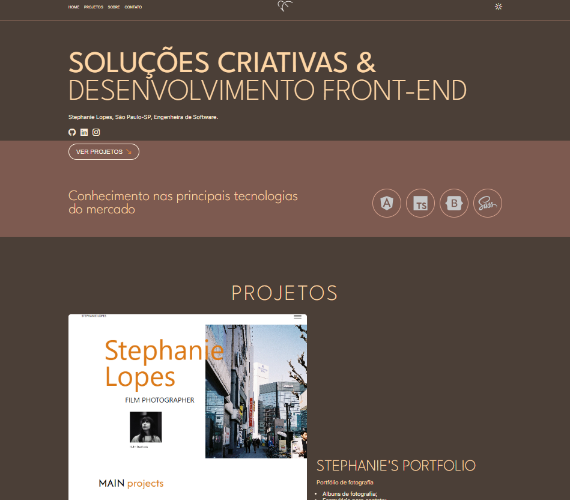

# Portfólio Front-end

Bem-vindo(a) ao repositório!

Este projeto é uma adaptação do projeto estudado nas aulas do bootcamp Front-end Santandar 2025, com foco em design limpo e acolhedor, utilizando tons pastéis de marrom e laranja para transmitir uma estética sofisticada e ao mesmo tempo amigável.

## Tecnologias Utilizadas

- HTML5
- CSS3
- JavaScript

## Estrutura do Projeto
```bash
 meu-projeto
 ┣  assets
 ┃ ┣  css
 ┃ ┣  images
 ┃ ┗  js
 ┣ index.html
 ┗ README.md
```

## Como Executar

1. Clone este repositório:
```
git clone https://github.com/stephanie-lops/trilha-javascript-dio-lab-portfolio
```

2. Acesse a pasta do projeto:
```
cd trilha-javascript-dio-lab-portfolio
```
3. Abra o arquivo index.html no navegador.

## Prévia Visual



Link deploy: [https://trilha-css-desafio-03-discord-respo.vercel.app/](https://trilha-javascript-dio-lab-portfolio.vercel.app/)

## Créditos
Projeto adaptado no Bootcamp Santander 2025 - Front End (DIO)

------------------------

# Portfolio Front-end

Welcome to the repository!

This project is an adaptation of the project trained in the Front-end Standard 2025 bootcamp classes, focusing on clean and welcoming design, using pastel shades of brown and orange to convey a sophisticated yet friendly aesthetic.

## Technologies Used

-HTML5
-CSS3
-JavaScript

## Project Structure
```bash my-project
┣ assets
┃ ┣ css
┃ ┣ images
┃ ┗js
┣ index.html
┗ README.md
```

## How to run

1. Clone this repository:
```
git clone https://github.com/stephanie-lops/trilha-javascript-dio-lab-portfolio
```

2. Access the project folder:

```
cd trilha-javascript-dio-lab-portfolio
```
3. Open the index.html file in your browser.

## Visual Preview


Link implementation: [https://trilha-css-desafio-03-discord-respo.vercel.app/](https://trilha-javascript-dio-lab-portfolio.vercel.app/)

## Credits
Project adapted for the Santander 2025 Bootcamp - Front End (DIO)
